 
 
 
## How to extract useful information from very noisy time series?
#### (Mid-Candidature Review Report)
 

By Yanfei Kang

 

*Main supervisor: Prof. Kate Smith-Miles*

*Associate supervisor: Dr. Danijel Belusic*

---

## Outline

>- Motivation

>- Methodology: two steps

>- Applications

>- Conclusion

>- Time-table for completing thesis

>- Publications

>- References

---

## Goal

- ** Pattern (shape) transition within turbulence.**

  >- Location?
  >- Similar?
  >- Physical mechanisms?
  >- How do they transit?

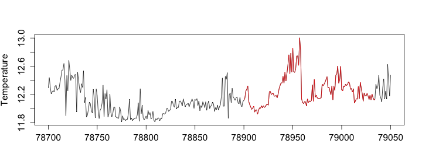 

--- &twocol w1:40% w2:60%

## Why is it difficult and important ?

*** =left

#### Difficult...

>-  Red noise.
>-  Varibility of spatial and temporal scales.
>-  Small amount of literature.    
>- Patterns   pre-defined? 
 

*** =right

#### Important...

>- Physical dynamics of turbulence.
>- Cared a lot by the scientific community.

 

---
## 
 
 
 
 
 
 

#### We are the first to solve this problem in turbulence area...

---

## Artificial time series

>- We started from artificial time series.

>- Four shapes: $l=128$
  
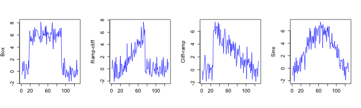 

>- Generation: $5$ instances of each $+$ Gaussian noise ($N(0,1)$) in-between:

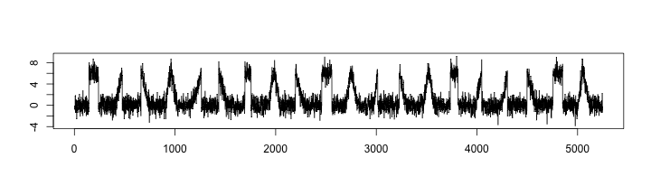 

---
## Initial idea?

##### Initial idea: 

  >- Cluster the *subsequences*.
  >- Get the prototypes.
  >- Meaningless clustering results (<a href="">Keogh & Lin (2005)</a>).

##### How to solve the problem?

  >- Meaningful method proposed.

---

## Methodology: two steps

>1. Extract shapes.

>2. Cluster the extracted shapes.

---

## $1$st step: shape extraction 

- Perform white noise test on each subsequence.

  >- **Why?** Only care the non-noise subsequences.

  >- **What?** Has no correlation between its values at different times.

  >- **How?**  Ljung-Box test (<a href="">Box & Pierce (1970)</a>).

---

## White noise test in time series

 
 *$H_0$*: The data are independently distributed; *$H_1$*: The data are not independently distributed.

 The test statistic is $$Q=n(n+2)\Sigma_{k=1}^{h}\frac{\hat{(\rho_k^2)}}{n-k},$$ where $n$ is the sample size, $\hat{\rho_k}$ is the sample autocorrelation at lag $k$, and $h$ is the number of lags being tested.

>- Then given a window length,  for the $q$th subsequence, get $p$-value $p_q$. For $x(t)$,  a $p$-value series:  $p_1,p_2,\cdots,p_{m-w+1}$.

--- 

## $p$-value series for the artificial data

#### Sliding window length: $w=128$

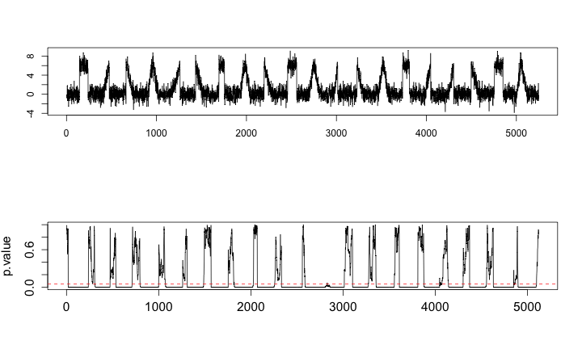 

---
## How to define shapes?

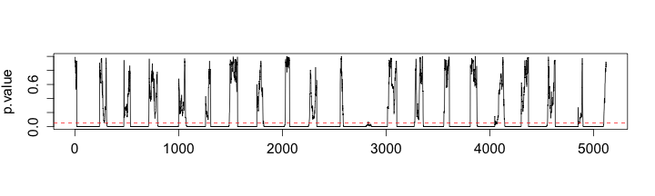 

- *A shape* is a subsequence whose noise test $p$ value is smaller than a predefined significant level $\alpha$ ($\alpha=0.05$).

- Assume there exists a consecutive sequence of $p$ values $p_s,p_{s+1},\cdots,p_t$ which satisfies: 

  - $p_i\leq \alpha, i=s, s+1, \cdots, t$
  - $t-s\geq w/2$ 

    then we define the subsequence $x_{\left\lfloor\frac{t+s}{2}\right\rfloor}(t)$ as *the shape* we are interested in.

---
## Advantages?

>- Avoids the meaningless clustering issue.

>- Statistically  non-noise.

---

## Shapes extracted

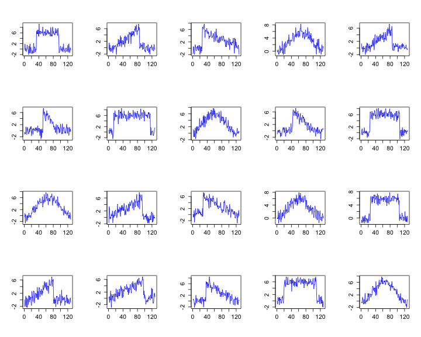 

---

## Robust to noise?

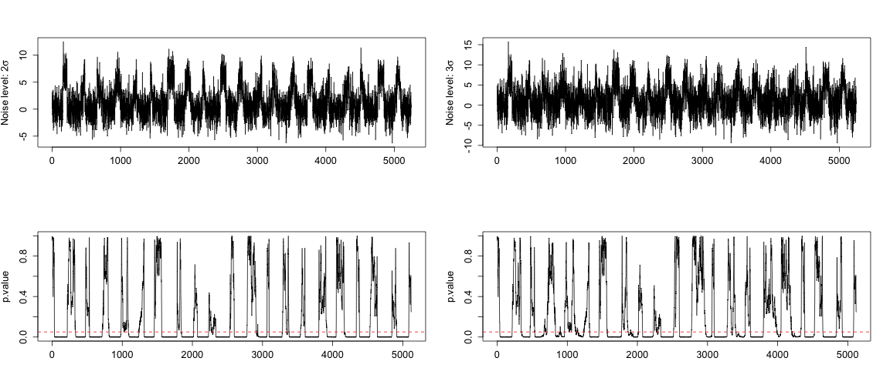 

---

## Red noise test in time series

>- **Why?** Many areas, such as climate, rely on red noise (<a href="">Storch & Zwiers (1999)</a>).

>- **What?**   $AR(1)$ stationary Gaussian process at unit lag (<a href="">Storch & Zwiers (1999)</a>): $$x(t)=\phi x(t-1)+\epsilon(t),$$
  where $x(t)$ is the value of variable at time $t$, $\phi$ is the autocorrelation coefficient with lag $1$, $\epsilon(t)$ is the value of white noise function at time $t$.
  
>- **How?**  See next slide.

---

## Red noise test in time series

- To test whether a subsequence is red noise
  
  >- Firstly fit an $AR(1)$ model on the subsequence
  
  >- Perform white noise test on the residuals. 
  
  >- Residuals: white noise?

- Extract shapes according to the red noise $p$-value series.

---

## How effective is the first step?

Two ways:

>- Models

>- Phase randomization (<a href="">Dahlhaus et al. (2010)</a>)

---
## Way $1$: Models

- Randomly generate $1000$ $AR(1)$ (linear) models with $l=500$

    >* $x_t=\phi*x_{t-1}+\epsilon_t$
    >* $\phi=0.9$
    >* $\text{var}(\epsilon_t)=1-\phi^2$
    
- Introduce non-linear components into the linear models (<a href="http://dx.doi.org/ http://dx.doi.org/10.1175/JAM2512.1">Gluhovsky & Agee (2007)</a>)

    >* $y_t=x_t+a*(x_t^2-1)$
    >* The parameter $a$ is to control the non-linearity of $y_t$.

- Investigate change of shape numbers before and after including the non-linear components
  

--- &twocol w1:40% w2:60%
## Results
*** left
#### 
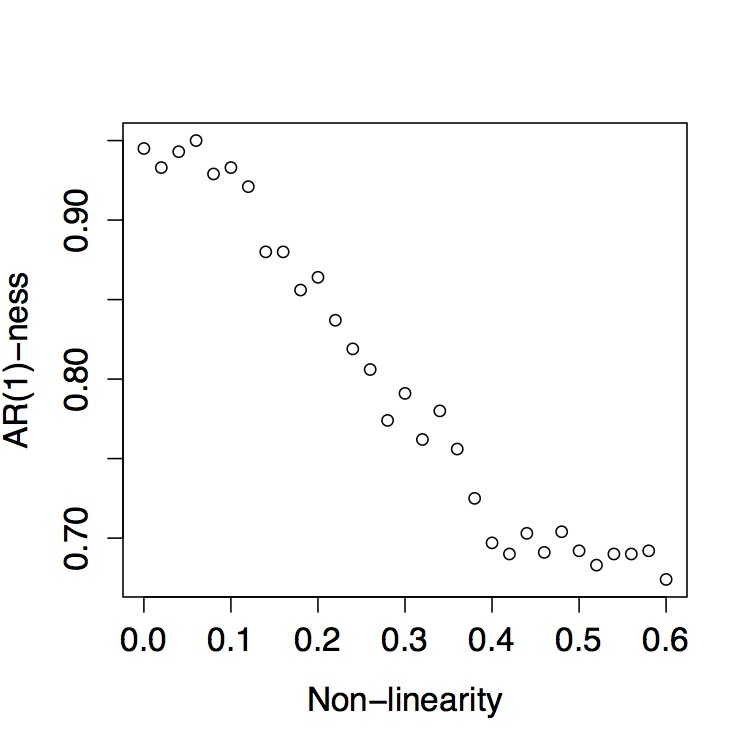

*** right

#### Conclusion

>* Percentage of models whose residual test $p$ values are larger-than-$.05$ decreases as $a$ goes larger.

>* Time series becomes less $AR(1)$ (red-noise)-like with larger $a$ introduced.

---
## Way $2$: Phase Randomization 

>* Take the Fourier Transform of the Turbulence temperature time series with length $l=20000$.

>* Randomize phase information while keeping the magnitude.

>* Do inverse Fourier Transform to get back to time domain.

>* Investigate change of shape numbers and total length of shapes after phase randomization.

--- &twocol w1:40% w2:60%
## Results
*** left
#### 
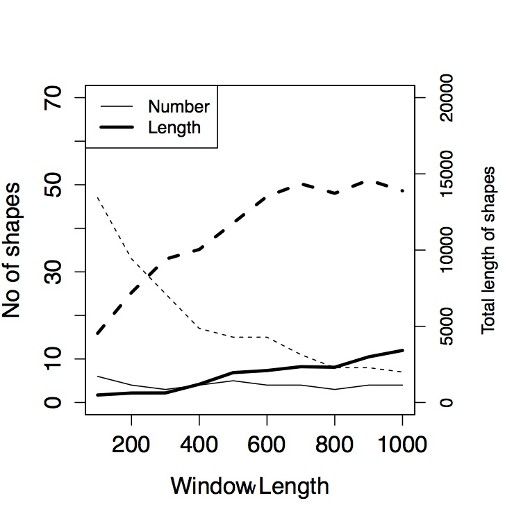

*** right
#### Conclusion
 

>* Phase randomization leads to much less shapes.

>* Not recognizing shapes without structures.

---

## Noise tests on artificial data with red noise
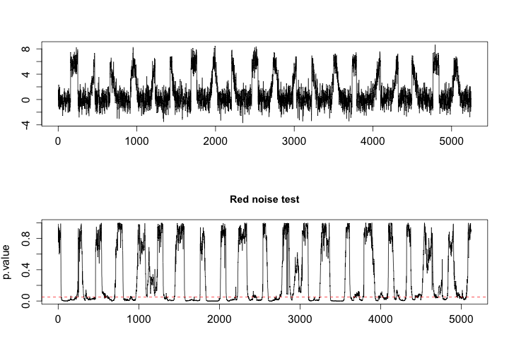 

---
## Red noise test essential? 

#### The answer is Yes!

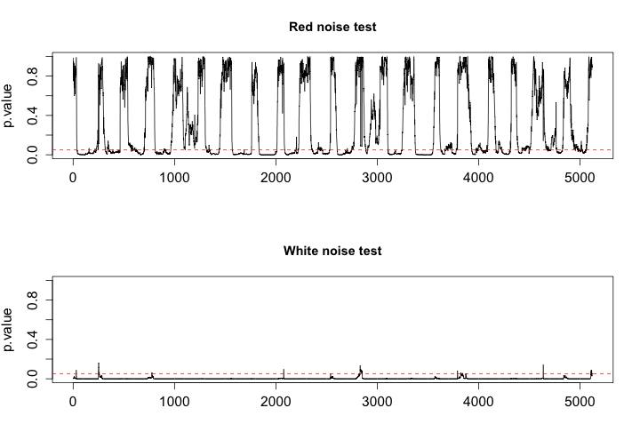 

---

##  How to explain these shapes?

#### Are some of them similar to each other?
#### Could they be organized in some way?

 

--- 

## $2$nd step

#### Goal: cluster the extracted shapes into patterns. 

> A cluster is a set of entities that are alike, and entities from different clusters are not alike. 

> -- *<a href="http://dx.doi.org/10.1002/9780470977811.ch1">Everitt et al. (2011)</a>*

- Clustering can be used for understanding data.

- To perform clustering we need to understand data.

--- &twocol w1:40% w2:60%
## Understanding data

*** left
###### Shapes

*** right

###### Features

1. `standard deviation`
2. `serial-correlation`
3. `trend`
4. `maximum` of the first order difference. 
5. `minimum` of the first order difference. 
6. `standard deviation` of the first order difference. 
7. `serial-correlation` of the first order difference. 

---
## How to cluster the shapes?

- Hierarchical clustering based on features (<a href="">Wang et al. (2006)</a>). 

  >- Avoid high dimensional input.
  >- Describe the dynamics of the shapes efficiently.
  >- Enable the comparison of the shapes with different lengths.

- The feature set can be chosen for a specific application to best capture the underlying characteristics of the shapes.

---

## Clustering results

 Hierarchical clustering of the extracted shapes in the feature space.

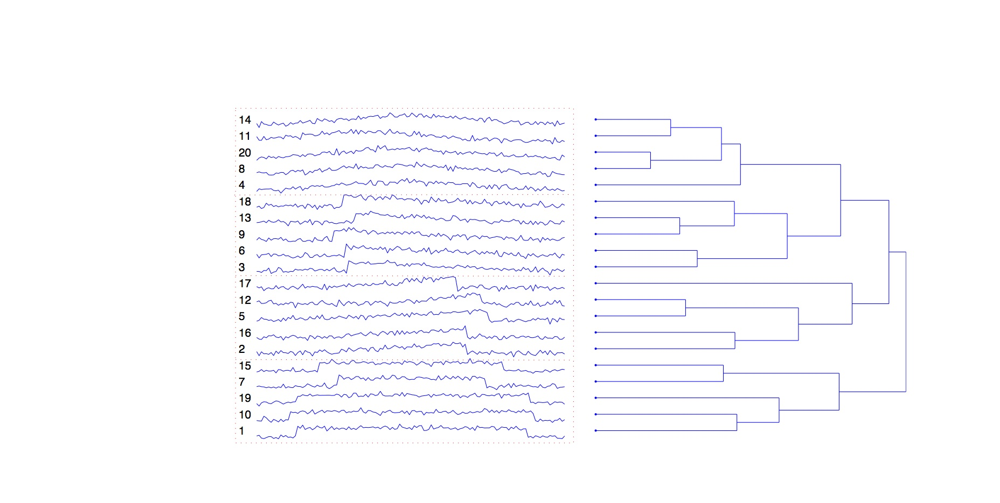

---

## Why features?

 The left figure is based on raw data; the right figure is based on features.

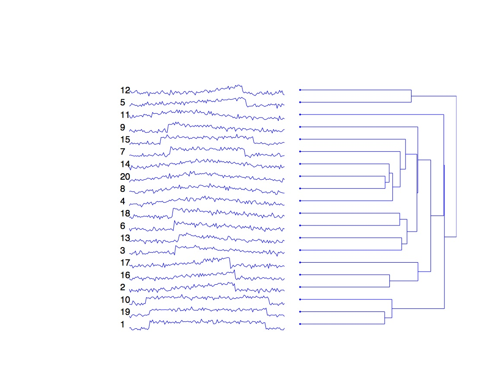

 

&#160 1. No features $=$ Bad clustering.

&#160 2. Similar in euclidean distances $\neq$ Similar shapes. 

&#160 3. Similar shapes with different shifts or lengths $\rightarrow$ One cluster.

---

## Comparison with literature 

 The left shows shapes found using the method in <a href="">Mueen et al. (2009)</a> while the right using ours.

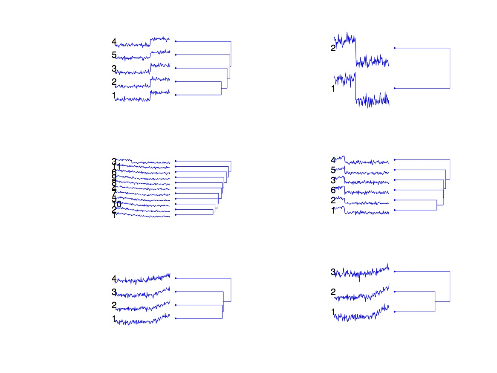

 
 
 

&#160 1. Shapes with noise.

&#160 2. Our method can avoid the problem.

---
## Other results

The clustering can be done in an on-line manner using the Growing Feature Quantization method proposed in <a href="http://dx.doi.org/10.1109/IJCNN.2012.6252381">Kang (2012)</a>.
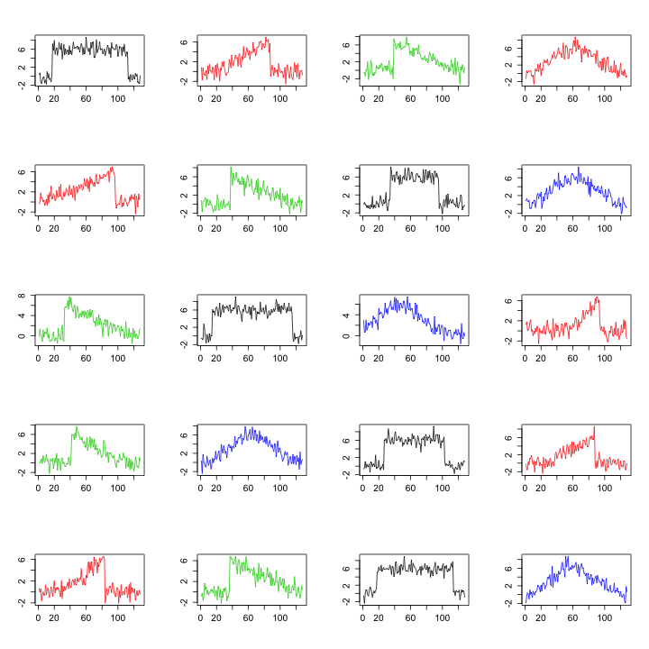 

---

## Application to turbulence: data

>- Cooperative Atmosphere-Surface Exchange Study (CASES-99), conducted near Leon, Kansas, USA, during October, 1999 (<a href="http://dx.doi.org/110.1175/1520-0477(2002)083<0555:CACIOT>2.3.CO;2">Poulos et al. (2002)</a>). 

>- The air temperature on October 5 is analyzed for extraction, clustering and explanation of shapes.

>- $1$ Hz data; $24$ hours.

>- $l=86400.$

---

## Feature set

  
###### Shape features

  - `Smoothness`: $\frac{\text{sd}(\text{diff}(x))}{\text{mean(diff}(x)}$
  - `diff kurtosis`:  kurtosis of diff($x$)
  - `diff Max`: $\text{max}(\text{diff}(x,\text{lag}=5))$
  - `diff Min`: $\text{min}(\text{diff}(x,\text{lag}=5))$
  - `sd`: measured in the same way as in the artificial time series
  - `Kurtosis`: measured in the same way as before
  - `Skewness`: measured in the same way as before
  - `Peroid`:  measured in the same way as before
  
###### Physical feature: Stability  measure using **Richardson number** $R$.

  - $R=\frac{N^2}{S^2}$
  - $N^2=\frac{g}{\bar{\theta}} \frac{\partial \bar{\theta}}{\partial z}$, where $\theta=T+0.01*z$, $z$ is the level height.
  - $S^2=(\frac{\partial \bar{u}}{\partial z})^2+(\frac{\partial \bar{v}}{\partial z})^2$, where $u$ and $v$ are the wind vectors from different directions.  

--- &twocol w1:40% w2:60%

## Clustering

*** left
####  Heatmap

*** right
#### Cluster center ($k=7$)
 

<!-- html table generated in R 3.0.2 by xtable 1.7-1 package -->
<!-- Thu Mar 20 16:12:23 2014 -->
<TABLE border=1>
<TR> <TH>  </TH> <TH> 1 </TH> <TH> 2 </TH> <TH> 3 </TH> <TH> 4 </TH> <TH> 5 </TH> <TH> 6 </TH> <TH> 7 </TH>  </TR>
  <TR> <TD align="right"> stability </TD> <TD align="right"> -0.18 </TD> <TD align="right"> -0.09 </TD> <TD align="right"> -0.20 </TD> <TD align="right"> 0.10 </TD> <TD align="right"> 0.09 </TD> <TD align="right"> 0.11 </TD> <TD align="right"> 0.31 </TD> </TR>
  <TR> <TD align="right"> sd </TD> <TD align="right"> 0.55 </TD> <TD align="right"> 0.52 </TD> <TD align="right"> 0.47 </TD> <TD align="right"> 0.15 </TD> <TD align="right"> 0.16 </TD> <TD align="right"> 0.15 </TD> <TD align="right"> 0.14 </TD> </TR>
  <TR> <TD align="right"> smoothness </TD> <TD align="right"> 0.41 </TD> <TD align="right"> 0.41 </TD> <TD align="right"> 0.33 </TD> <TD align="right"> 0.13 </TD> <TD align="right"> 0.12 </TD> <TD align="right"> 0.11 </TD> <TD align="right"> 0.03 </TD> </TR>
  <TR> <TD align="right"> kurtosis </TD> <TD align="right"> 3.20 </TD> <TD align="right"> 2.73 </TD> <TD align="right"> 4.07 </TD> <TD align="right"> 3.01 </TD> <TD align="right"> 2.48 </TD> <TD align="right"> 3.77 </TD> <TD align="right"> 2.01 </TD> </TR>
  <TR> <TD align="right"> skewness </TD> <TD align="right"> 0.88 </TD> <TD align="right"> 0.55 </TD> <TD align="right"> 1.17 </TD> <TD align="right"> 0.39 </TD> <TD align="right"> 0.23 </TD> <TD align="right"> 0.81 </TD> <TD align="right"> 0.30 </TD> </TR>
  <TR> <TD align="right"> peroid </TD> <TD align="right"> 38.55 </TD> <TD align="right"> 2.69 </TD> <TD align="right"> 1.00 </TD> <TD align="right"> 21.65 </TD> <TD align="right"> 1.00 </TD> <TD align="right"> 1.00 </TD> <TD align="right"> 1.00 </TD> </TR>
  <TR> <TD align="right"> diff kurtosis </TD> <TD align="right"> 4.43 </TD> <TD align="right"> 3.92 </TD> <TD align="right"> 4.85 </TD> <TD align="right"> 3.38 </TD> <TD align="right"> 2.97 </TD> <TD align="right"> 4.46 </TD> <TD align="right"> 3.40 </TD> </TR>
  <TR> <TD align="right"> diff max </TD> <TD align="right"> 4.12 </TD> <TD align="right"> 4.66 </TD> <TD align="right"> 3.78 </TD> <TD align="right"> 5.04 </TD> <TD align="right"> 4.64 </TD> <TD align="right"> 4.96 </TD> <TD align="right"> 2.27 </TD> </TR>
  <TR> <TD align="right"> diff min </TD> <TD align="right"> -5.71 </TD> <TD align="right"> -6.26 </TD> <TD align="right"> -4.64 </TD> <TD align="right"> -5.17 </TD> <TD align="right"> -4.28 </TD> <TD align="right"> -4.34 </TD> <TD align="right"> -2.22 </TD> </TR>
   </TABLE>

---
## Results on turbulence time series

#### Instances of extracted shapes in ramplike cluster:

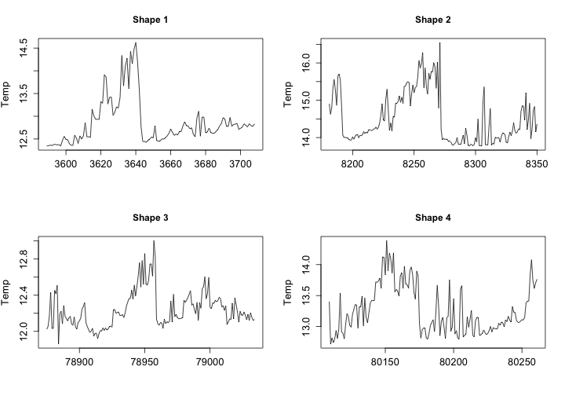 

---
## Results on turbulence time series

#### Instances of extracted shapes in other clusters:

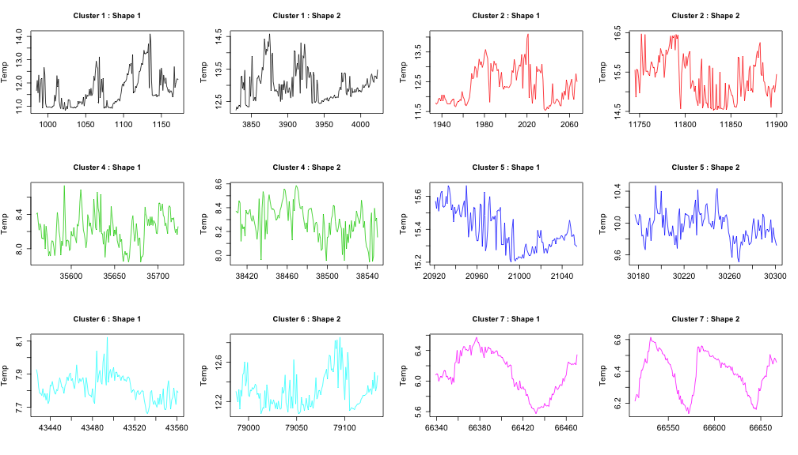 

---
## Cluster transition of shapes
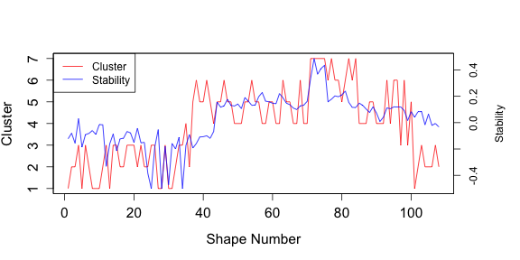 

>- With the stability changing from - to + and - again (time changing from day to night and back to day time), the shape cluster number changes at the same time.

>- In line with the reality.

>- Meaningfulness of the shape clustering.

---
## Conclusion

- A two-step method for shape extraction from time series is proposed: 

  >- A noise test
  >- An organization of the extracted shapes
  
- Better results than literature

- Robust to noise level

- Applied to artificial data 

- Applied to real world data

- A big step regarding turbulence time series shape extraction. 

---

## Time-table for completing thesis

##### Apr 2013 - May 2013 

  - Attend the 2013 IEEE Symposium Series on Computational Intelligence and give a presentation.
  - Submit the journal paper.
  - Apply the method to the **FLOSS** dataset we have, which is so complicated that nobody knows what happens regarding shapes.
  - Apply the method to multiple time scales to get shapes with different temporal scales.

##### June 2013

  - **List** all the statistical features that are helpful for clustering. 
  - Find a way to **justify** feature set selection, either by visualization or optimization methods.
  - Check whether there are other features that may help to describe characteristics of the shapes in this particular dataset.

--- 

## Time-table for completing thesis

##### July 2013 - Aug 2013

  - Cluster the shapes found in the dataset based on the proper feature set.
  - Determine the characteristics of each cluster.
  - Find the differences and similarities between cluster behaviors.
  - Determine the physical mechanisms of each cluster.
  - Extend the analysis to the available **multivariate and multidimensional** time series from FLOSS.
  - Investigate the possibility of automatically classifying different physical mechanisms using multivariate and multidimensional features in clustering.
  - Get a conclusion about the behaviors of the turbulence in FLOSS dataset.
  - Submit a journal paper on the physical interpretation of shapes from FLOSS dataset. 

--- 

## Time-table for completing thesis

##### Sep 2013 - Oct 2013

  - Based on the completion of the shape detection method, look at the application to **other areas** such as chemical spectrum detection in spectroscopy (<a href="http://dx.doi.org/10.1109/TAES.2012.6129647">Ding et al. (2012)</a>).
  - Look at the application on sleep stages (<a href="http://dx.doi.org/10.1109/IEMBS.2001.1020608">Hese et al. (2001)</a>).
  - Get some conclusions.

##### Nov 2013

  - **Revisit** the change detection examples used in 2011 and apply the shape extraction method to them.
  - Check whether it helps with the change detection and how it relates to the change detection method.
  
##### Dec 2013 - Mar 2014 

  - Based on the above research results, begin to write up the first draft of thesis.
  - Revise the **thesis** and submit it.

---
## Publications

Kang Y (2012).
&ldquo;Real-time change detection in time series based on growing feature quantization.&rdquo;
In <EM>Proceedings of the 2012 International Joint Conference on Neural Networks (IJCNN)</EM>, pp. 1&ndash;6.
<a href="http://dx.doi.org/10.1109/IJCNN.2012.6252381">http://dx.doi.org/10.1109/IJCNN.2012.6252381</a>.

Kang Y, Smith-Miles K and Belusic D (2013).
&ldquo;How to Extract Meaningful Shapes from Noisy Time-Series Subsequences? (In press).&rdquo;
In <EM>Proceedings of the 2013 IEEE Symposium Series on Computational Intelligence (SSCI)</EM>.

Kang Y, Smith-Miles K and Belusic D (2013).
&ldquo;A Shape Extraction Method for Atomospheric Time Series. (In preparation).&rdquo;
<EM>Quarterly Journal of Royal Meterorological Society</EM>.

---
## References

Kang Y, Smith-Miles K and Belusic D (2013).
&ldquo;How to Extract Meaningful Shapes from Noisy Time-Series Subsequences? (In press).&rdquo;
In <EM>Proceedings of the 2013 IEEE Symposium Series on Computational Intelligence (SSCI)</EM>.

Storch HV and Zwiers FW (1999).
<EM>Statistical Analysis in Climate Research</EM>.
Cambridge University Press.

Mueen A, Keogh EJ, Zhu Q, Cash S and Westover MB (2009).
&ldquo;Exact Discovery of Time Series Motifs.&rdquo;
In <EM>Proceedings of SIAM International Conference on Data Mining (SDM)</EM>, pp. 473&ndash;484.

Wang X, Smith KA and Hyndman RJ (2006).
&ldquo;Characteristic-Based Clustering for Time Series Data.&rdquo;
<EM>Data Mining and Knowledge Discovery</EM>, <B>13</B>(3), pp. 335-364.

Kang Y (2012).
&ldquo;Real-time change detection in time series based on growing feature quantization.&rdquo;
In <EM>Proceedings of the 2012 International Joint Conference on Neural Networks (IJCNN)</EM>, pp. 1&ndash;6.
<a href="http://dx.doi.org/10.1109/IJCNN.2012.6252381">http://dx.doi.org/10.1109/IJCNN.2012.6252381</a>.

Keogh EJ, Chakrabarti K, Pazzani MJ and Mehrotra S (2000).
&ldquo;Dimensionality Reduction for Fast Similarity Search in Large Time Series Databases.&rdquo;
<EM>Journal of Knowledge and Information Systems</EM>, <B>3</B>(3), pp. 263-286.

---
## References

Belusic D and Mahrt L (2012).
&ldquo;Is geometry more universal than physics in atmospheric boundary layer flow?&rdquo;
<EM>Journal of Geophysical Research</EM>, <B>117</B>(D09115).
<a href="http://dx.doi.org/10.1029/2011JD016987">http://dx.doi.org/10.1029/2011JD016987</a>.

Chakrabarti K, Keogh EJ, Mehrotra S and Pazzani MJ (2002).
&ldquo;Locally adaptive dimensionality reduction for indexing large time series databases.&rdquo;
<EM>ACM Transcations on Database Systems (TODS)</EM>, <B>27</B>(2), pp. 188-228.

Keogh EJ, Hochheiser H and Shneiderman B (2002).
&ldquo;An Augmented Visual Query Mechanism for Finding Patterns in Time Series Data.&rdquo;
In Andreasen T, Motro A, Christiansen H and Larsen HL (eds.), <EM>Proceedings of Flexible Query Answering Systems (FQAS), the 5th International Conference</EM>, volume 2522 series Lecture Notes in Computer Science, pp. 240-250.
ISBN 3-540-00074-7.

Das G, Lin KI, Mannila H, Renganathan G and Smyth P (1998).
&ldquo;Rule Discovery from Time Series.&rdquo;
In <EM>Proceedings of the 4th International Conference on Knowledge Discovery and Data Mining (KDD)</EM>, pp. 16-22.

Agrawal R, Faloutsos C and Swami AN (1993).
&ldquo;Efficient Similarity Search In Sequence Databases.&rdquo;
In Lomet D (ed.), <EM>Proceedings of the 4th International Conference of Foundations of Data Organization and Algorithms (FODO)</EM>, pp. 69&ndash;84.

Chan KP and Fu AWC (1999).
&ldquo;Efficient Time Series Matching by Wavelets.&rdquo;
In Kitsuregawa M, Papazoglou MP and Pu C (eds.), <EM>Proceedings of the 15th International Conference on Data Engineering (ICDE)</EM>, pp. 126-133.
ISBN 0-7695-0071-4.

---

## Questions?

